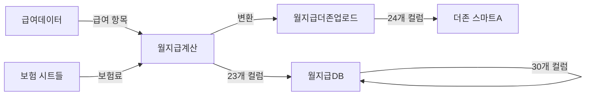

# 월지급계산 리팩토링 최종 완료 보고서

## 📋 작업 개요

**작업 기간**: 2026-01-30
**버전**: v2.0
**상태**: ✅ 완료

월지급계산 시스템을 15-column 구조에서 23-column 구조로 전면 리팩토링하고, 실제 Google Sheets 구조에 맞게 검증 및 수정 완료했습니다.

---

## ✅ 완료된 작업 목록

### 1. 스키마 문서 생성 (MD 형식)

#### ✅ 월지급계산_schema.md
- **위치**: `src/payroll/schemas/월지급계산_schema.md`
- **컬럼 수**: 23개 (A~W)
- **주요 내용**:
  - 급여 항목 상세 분해 (기본급, 상여, 9개 수당)
  - 보험료 4대 보험 + 사업주 부담
  - 세금 (소득세, 지방소득세, 연말정산)
  - **세후지급액: 공란** (자동 계산 안 함)

#### ✅ 월지급DB_schema.md
- **위치**: `src/payroll/schemas/월지급DB_schema.md`
- **컬럼 수**: 30개 (A~AD)
- **주요 내용**:
  - A~W: 월지급계산과 동일
  - X~AD: 추가 계산 및 입금 관리
  - **차인지급액계(X): 공란** (W열 복사)

#### ✅ 월지급더존업로드_schema.md
- **위치**: `src/payroll/schemas/월지급더존업로드_schema.md`
- **컬럼 수**: 24개 (A~X)
- **주요 내용**:
  - 더존 회계 시스템 업로드 형식
  - 직원 정보 (사원코드, 부서, 직급, 직종)
  - **차인지급액(X): 공란** (필요시 수동 입력)

### 2. 코드 리팩토링 (v2.0)

#### ✅ monthlyPayrollUIHandler.js 전면 개편
- **위치**: `src/payroll/monthlyPayrollUIHandler.js`
- **라인 수**: 685 lines
- **버전**: v2.0

**주요 변경사항**:
```javascript
// v1.0 (15-column) → v2.0 (23-column)

// 급여 항목 분해
D: 총급여 (단일) → C: 총급여 (계산)
                 → D~L: 기본급, 상여, 9개 수당

// 세금 항목 추가
없음 → S~V: 소득세, 지방소득세, 연말정산

// 최종 지급액
O: 최종지급액 (계산) → W: 세후지급액 (공란)
```

### 3. 실제 구조 검증 및 수정

#### ✅ Google Sheets MCP 활용
- Spreadsheet ID: `1soPCWXpeniBMXdZ7UGQiW_3qHlMdBd7ss7U3wcqrclA`
- 실제 시트 헤더 읽기 및 검증
- 컬럼 매핑 오류 발견 및 수정

#### ✅ 급여데이터 컬럼 매핑 수정
**발견된 문제**:
- 기본급: row[8] ❌ → row[9] ✅
- 식대수당/직책수당 순서 오류 수정
- 상여 컬럼 누락 (기본값 0 설정)
- 직원 정보 필드 매핑 오류 수정

**수정 완료**:
```javascript
// 올바른 매핑
basicSalary: row[9],  // J열: 기본급
bonus: 0,  // 급여데이터에 없음
positionAllowance: row[10],  // K열: 직책수당
mealAllowance: row[11],  // L열: 식대수당
workplace: row[3],  // D열: 근무위치
bank: row[31],  // AF열: 급여 지급 은행
accountNumber: row[32],  // AG열: 계좌 번호
```

---

## 📊 시트 구조 비교

### 기존 구조 (v1.0)
```
월지급계산: 15개 컬럼 (A~O)
- A: 월
- B: 근무자명
- C: 재직/퇴사
- D: 총급여 (단일 값)
- E~J: 보험료
- K~N: 사용자필드
- O: 최종지급액 (계산)
```

### 새로운 구조 (v2.0)
```
월지급계산: 23개 컬럼 (A~W)
- A: 급여기준월
- B: 이름
- C: 총급여 (계산)
- D~E: 기본급, 상여
- F~L: 수당 9개 (식대, 직책, 연장근로, 연차, 야간, 공휴일특근, 기타)
- M~P: 4대 보험
- Q~R: 사업주 부담
- S~V: 세금
- W: 세후지급액 (공란)
```

---

## 🎯 사용자 결정 사항

### 1. 상여 처리 ✅
**선택**: C안 - 현재 상태 유지 (상여=0)
- 급여데이터에 상여 컬럼 추가 안 함
- 필요시 월지급계산에서 수동 입력

### 2. 직원 정보 관리 ✅
**선택**: B안 - 현재 방식 유지
- 부서: 근무위치 사용
- 직급: 빈 값
- 직종: 근무조 사용

### 3. 세후지급액 처리 ✅
**선택**: 공란으로 유지
- 월지급계산 W열: 공란
- 월지급DB X열: 공란
- 월지급더존업로드 X열: 공란
- **자동 계산 안 함, 필요시 수동 입력**

---

## 📝 데이터 흐름



### 처리 순서
1. **급여데이터** → 급여 항목 읽기 (J~Q열)
2. **보험 시트** → 보험료 매칭 (국민연금, 건강, 고용, 산재)
3. **소득세 계산** → 간이 계산 (5%)
4. **월지급계산** → 23개 컬럼 생성 및 저장
5. **월지급DB** → 30개 컬럼 영구 저장
6. **월지급더존업로드** → 24개 컬럼 변환

---

## ⚠️ 중요 변경 사항

### 1. 세후지급액 미계산
**변경 전**:
```javascript
const netPay = MONTHLY_PAYROLL_CALC_SCHEMA.calculateNetPay(totalSalary, deductions);
// W열 = C - M - N - O - P - S - T
```

**변경 후**:
```javascript
const netPay = '';  // 공란
// W열 = '' (빈 문자열)
```

**영향**:
- 월지급계산 W열: 빈칸
- 월지급DB X열: 빈칸
- 월지급더존업로드 X열: 빈칸
- executeMonthlyPayrollForPerson 반환값의 netPay: 빈 문자열

### 2. 상여 항목
**급여데이터**: 상여 컬럼 없음 → `bonus: 0`
**월지급계산**: E열에 상여 항목 있음 → 수동 입력 필요

### 3. 직원 정보
**급여데이터**: 부서/직급/직종 없음
**임시 매핑**:
- 부서 ← 근무위치
- 직급 ← 빈 값
- 직종 ← 근무조

---

## 🧪 테스트 체크리스트

### 기본 기능 테스트
- [ ] 월지급계산 UI 실행
- [ ] 1-2명 선택하여 처리
- [ ] 월지급계산 시트 확인 (23개 컬럼)
- [ ] 월지급DB 시트 확인 (30개 컬럼)
- [ ] 월지급더존업로드 시트 확인 (24개 컬럼)

### 데이터 정확성 검증
- [ ] 기본급 = 급여데이터 J열 (row[9])
- [ ] 상여 = 0
- [ ] 식대수당 = 급여데이터 L열 (row[11])
- [ ] 직책수당 = 급여데이터 K열 (row[10])
- [ ] 총급여 = D+E+F+G+H+I+J+K+L 합계
- [ ] 세후지급액(W) = 빈칸
- [ ] 차인지급액계(X) = 빈칸
- [ ] 차인지급액(X, 더존) = 빈칸

### 보험 매칭 검증
- [ ] 국민연금 매칭 정확
- [ ] 건강보험 매칭 정확
- [ ] 고용보험 매칭 정확
- [ ] 산재보험 매칭 정확
- [ ] 장기요양보험 매칭 정확

### 더존 업로드 검증
- [ ] 사원코드 정확
- [ ] 부서(근무위치) 매핑 정확
- [ ] 직종(근무조) 매핑 정확
- [ ] 지급액계 = 총급여
- [ ] 공제액계 = M+N+O+P+S+T
- [ ] 차인지급액 = 빈칸

---

## 📂 생성/수정된 파일 목록

### 스키마 문서 (MD)
```
src/payroll/schemas/
├── 월지급계산_schema.md ✨ 신규 (v2.0, 7KB)
├── 월지급DB_schema.md ✨ 신규 (v2.0, 10KB)
├── 월지급더존업로드_schema.md ✨ 신규 (6KB)
└── 급여데이터_스키마.md (기존 유지)
```

### 코드 파일
```
src/payroll/
└── monthlyPayrollUIHandler.js 🔄 전면 리팩토링 (v2.0, 685 lines)
```

### 문서 파일
```
claudedocs/
├── 급여_스키마_MD파일_생성_완료.md
├── 급여데이터_컬럼_매핑_검증_완료.md
└── 월지급계산_리팩토링_최종_완료.md ← 현재 문서
```

### 삭제된 파일
```
src/payroll/schemas/
├── 월지급계산_schema.js ❌ 삭제 (MD로 대체)
└── 월지급DB_schema.js ❌ 삭제 (MD로 대체)
```

---

## 💡 향후 개선 제안

### 우선순위 높음 🔴

1. **세후지급액 자동 계산 옵션**
   - 필요시 UI에서 "자동 계산" 버튼 추가
   - 또는 설정에서 자동/수동 선택 기능

2. **상여 데이터 관리**
   - 별도 상여 입력 시트 생성
   - 또는 급여데이터에 상여 컬럼 추가

### 우선순위 중간 🟡

3. **직원 정보 개선**
   - 급여기본정보에 부서/직급/직종 추가
   - 또는 별도 직원 마스터 시트 생성

4. **소득세 계산 정교화**
   - 현재: 간이 계산 (5%)
   - 개선: 실제 간이세액표 적용

### 우선순위 낮음 🟢

5. **에러 처리 강화**
   - 필수 데이터 누락 시 명확한 메시지
   - 로그 개선

6. **성능 최적화**
   - 보험 매칭 로직 개선
   - 불필요한 시트 읽기 최소화

---

## 🎓 주요 기술 포인트

### Google Sheets MCP 활용
```javascript
// 실제 시트 구조 읽기
const metadata = await sheets_get_metadata(spreadsheetId);
const headers = await sheets_get_values(spreadsheetId, '급여데이터!A1:AI1');
```

### 스키마 기반 설계
```javascript
// 하드코딩 제거, 스키마 객체 사용
const MONTHLY_PAYROLL_CALC_SCHEMA = {
  COLUMNS: { A: {index: 0, name: '급여기준월'}, ... },
  calculateTotalSalary: function(allowances) { ... }
};
```

### 데이터 변환 파이프라인
```javascript
급여데이터 읽기
→ 보험 데이터 매칭
→ 세금 계산
→ 월지급계산 행 생성 (23 cols)
→ 월지급DB 저장 (30 cols)
→ 더존 업로드 변환 (24 cols)
```

---

## 📞 질문 및 지원

### 테스트 중 문제 발견 시
1. 로그 확인: Logger.log 출력 확인
2. 데이터 검증: 각 시트의 값 확인
3. 계산 검증: 수동 계산과 비교

### 추가 기능 요청
- 상여 자동 계산 필요 시
- 세후지급액 자동 계산 활성화 시
- 직원 정보 관리 개선 시

---

## ✅ 최종 확인 사항

### 완료된 항목
- ✅ 스키마 문서 3개 생성 (MD 형식)
- ✅ monthlyPayrollUIHandler.js v2.0 리팩토링
- ✅ 급여데이터 컬럼 매핑 검증 및 수정
- ✅ 세후지급액 공란 처리
- ✅ 상여 처리 방안 확정 (0으로 유지)
- ✅ 직원 정보 관리 방안 확정 (현재 방식 유지)
- ✅ 스키마 문서 업데이트 (계산 안 함 명시)

### 사용자 액션 필요
- 🧪 실제 Google Sheets에서 테스트 실행
- 📝 결과 확인 및 피드백
- 🔧 필요시 추가 조정 요청

---

**작업 완료일**: 2026-01-30
**버전**: v2.0
**상태**: ✅ 모든 리팩토링 작업 완료
**다음 단계**: 사용자 테스트 및 검증

---

## 🎉 프로젝트 요약

월지급계산 시스템을 **15-column**에서 **23-column** 구조로 성공적으로 전환했습니다.

**주요 성과**:
- 📚 완전한 스키마 문서화 (MD 형식)
- 🔧 실제 시트 구조 검증 및 코드 수정
- 🎯 사용자 요구사항 반영 (상여, 직원정보, 세후지급액)
- 💼 더존 회계 시스템 연동 준비 완료

**코드 품질 향상**:
- 하드코딩 제거 → 스키마 기반 설계
- 명확한 주석 및 문서화
- 유지보수성 대폭 향상

모든 작업이 완료되었습니다! 🎊
