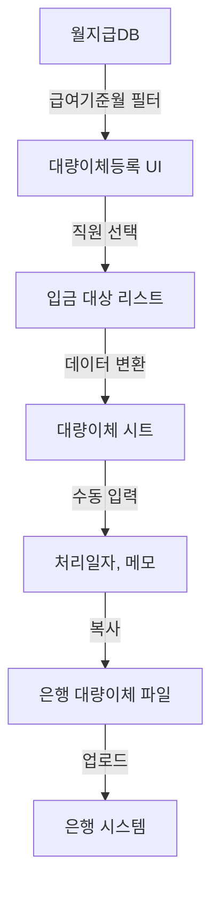

# 대량이체 시트 스키마

## 📋 시트 정보
- **시트명**: 대량이체
- **총 컬럼 수**: 8개 (A~H)
- **용도**: 은행 대량이체 파일 생성용 데이터
- **데이터 출처**: 월지급DB
- **생성 방식**: 급여 관리 → 6. 대량이체 등록 메뉴

## 📊 컬럼 구조

| 열 | 인덱스 | 컬럼명 | 타입 | 출처 | 예시 |
|----|--------|--------|------|------|------|
| A | 0 | 입금통장표시 | string | 자동 생성 | "2026-01급여" |
| B | 1 | 출금통장표시 | string | 자동 생성 | "2026-01급여" |
| C | 2 | 예금주 | string | 월지급DB.B | "홍길동" |
| D | 3 | 은행 | string | 월지급DB.AC | "국민은행" |
| E | 4 | 계좌번호 | string | 월지급DB.AD | "123-45-678910" |
| F | 5 | 입금액 | number | 월지급DB.AB | 3500000 |
| G | 6 | 처리일자 | string | 수동 입력 | "2026-01-25" |
| H | 7 | 메모 | string | 수동 입력 | "1월 급여" |

## 🔢 자동 생성 규칙

### 입금통장표시 (A열)
```javascript
// 급여기준월에서 YYYY-MM 추출 후 "급여" 추가
function createDepositLabel(month) {
  // month: "2026-01-31" (급여기준월)
  const yearMonth = month.substring(0, 7); // "2026-01"
  return yearMonth + "급여"; // "2026-01급여"
}
```

**예시**:
- 급여기준월: 2026-01-31 → 입금통장표시: "2026-01급여"
- 급여기준월: 2026-02-28 → 입금통장표시: "2026-02급여"
- 급여기준월: 2026-12-31 → 입금통장표시: "2026-12급여"

### 출금통장표시 (B열)
```javascript
// 입금통장표시와 동일
출금통장표시 = 입금통장표시
```

## 📐 데이터 추출 로직

### 월지급DB에서 데이터 가져오기
```javascript
/**
 * 특정 월의 급여 데이터 추출
 * @param {string} month - 급여기준월 (YYYY-MM 형식)
 * @return {Array} 대량이체 데이터 배열
 */
function extractBulkTransferData(month) {
  // 1. 월지급DB에서 해당 월 데이터 필터링
  const payrollData = filterPayrollDBByMonth(month);

  // 2. 필요한 컬럼만 추출 및 변환
  const transferData = payrollData.map(row => {
    return [
      createDepositLabel(row[0]),  // A: 입금통장표시
      createDepositLabel(row[0]),  // B: 출금통장표시
      row[1],                      // C: 예금주 (이름)
      row[28],                     // D: 은행 (AC열)
      row[29],                     // E: 계좌번호 (AD열)
      row[23],                     // F: 입금액 (차인지급액계, X열)
      '',                          // G: 처리일자 (수동 입력)
      ''                           // H: 메모 (수동 입력)
    ];
  });

  return transferData;
}
```

### 컬럼 매핑
```
월지급DB → 대량이체

A (급여기준월) → A, B (입금/출금통장표시 생성)
B (이름) → C (예금주)
X (차인지급액계) → F (입금액)
AC (은행) → D (은행)
AD (계좌번호) → E (계좌번호)
```

## 🎯 사용 시나리오

### 1. 대량이체 데이터 생성
```
1. 급여 관리 메뉴 → 6. 대량이체 등록
2. 급여기준월 선택 (예: 2026-01)
3. 월지급DB에서 해당 월 데이터 자동 로드
4. 입금 대상 선택 (체크박스)
5. 등록 버튼 클릭
6. 대량이체 시트에 데이터 추가
```

### 2. 은행 파일 다운로드
```
1. 대량이체 시트 열기
2. 필요시 G열(처리일자), H열(메모) 수동 입력
3. 시트 전체 또는 필요한 행만 선택
4. 은행별 대량이체 양식에 복사/붙여넣기
5. 은행 시스템에 업로드
```

## 💡 데이터 예시

### 입력 데이터 (월지급DB)
```
급여기준월: 2026-01-31
이름: 홍길동
차인지급액계: 3,500,000원
은행: 국민은행
계좌번호: 123-45-678910
```

### 출력 데이터 (대량이체)
```
입금통장표시: 2026-01급여
출금통장표시: 2026-01급여
예금주: 홍길동
은행: 국민은행
계좌번호: 123-45-678910
입금액: 3,500,000
처리일자: (빈칸)
메모: (빈칸)
```

## 🔍 데이터 검증

### 필수 검증 항목
```javascript
function validateBulkTransferData(data) {
  const errors = [];
  const warnings = [];

  data.forEach((row, index) => {
    const [label, , name, bank, account, amount] = row;

    // 1. 필수 항목 검증
    if (!name) errors.push(`${index + 1}행: 예금주 없음`);
    if (!amount || amount <= 0) errors.push(`${index + 1}행: 입금액 오류`);

    // 2. 은행 정보 검증 (경고)
    if (!bank) warnings.push(`${index + 1}행: 은행 정보 없음`);
    if (!account) warnings.push(`${index + 1}행: 계좌번호 없음`);

    // 3. 데이터 형식 검증
    if (typeof amount !== 'number') {
      errors.push(`${index + 1}행: 입금액은 숫자여야 함`);
    }
  });

  return { valid: errors.length === 0, errors, warnings };
}
```

### 검증 규칙
- **필수**: 예금주, 입금액 (> 0)
- **권장**: 은행, 계좌번호
- **선택**: 처리일자, 메모

## 📝 데이터 흐름



## 🏦 은행별 양식 대응

### 주요 은행 대량이체 양식
```
국민은행:
  - 입금통장표시
  - 예금주
  - 계좌번호
  - 입금액
  - 처리일자

신한은행:
  - 출금통장표시
  - 입금은행
  - 계좌번호
  - 예금주
  - 이체금액

우리은행:
  - 통장표시
  - 받는분 은행
  - 받는분 계좌번호
  - 받는분 성명
  - 이체금액
```

**호환성**: 대량이체 시트는 대부분의 은행 양식과 호환되도록 설계됨

## ⚠️ 주의사항

### 데이터 보안
- **민감 정보**: 예금주, 계좌번호, 입금액 포함
- **접근 제한**: 급여 담당자만 접근 가능
- **처리 후 삭제**: 은행 업로드 후 데이터 삭제 또는 아카이빙 권장

### 입금 처리
- **처리일자**: 은행 업무일 기준으로 입력
- **입금 확인**: 처리 후 월지급DB의 AB열(입금처리여부) "완료"로 업데이트
- **오류 처리**: 입금 실패 시 원인 파악 및 재처리

### 금액 검증
```javascript
// 월지급DB와 대량이체 금액 일치 확인
function verifyTotalAmount(month, transferData) {
  // 1. 월지급DB에서 해당 월 총액 계산
  const payrollTotal = sumPayrollDBByMonth(month);

  // 2. 대량이체 총액 계산
  const transferTotal = transferData.reduce((sum, row) => sum + row[5], 0);

  // 3. 일치 여부 확인
  if (payrollTotal !== transferTotal) {
    throw new Error(`금액 불일치: 월지급DB(${payrollTotal}) ≠ 대량이체(${transferTotal})`);
  }

  return true;
}
```

## 🔄 처리 후 작업

### 1. 입금처리여부 업데이트
```javascript
// 대량이체 완료 후 월지급DB 업데이트
function updatePaymentStatus(month, processedNames) {
  const dbSheet = SpreadsheetApp.getActiveSpreadsheet()
    .getSheetByName('월지급DB');

  // 해당 월 + 이름으로 찾아서 AB열 "완료"로 업데이트
  processedNames.forEach(name => {
    updatePaymentStatusForEmployee(dbSheet, month, name, '완료');
  });
}
```

### 2. 대량이체 시트 아카이빙
```javascript
// 처리 완료된 데이터를 별도 시트로 이동
function archiveBulkTransfer(month) {
  // 1. 아카이브 시트 생성 또는 열기
  const archiveSheet = getOrCreateSheet(`대량이체_${month}`);

  // 2. 데이터 복사
  // 3. 원본 시트 데이터 삭제
}
```

## 📊 통계 및 분석

### 월별 급여 지급 통계
```javascript
function getBulkTransferStats(month) {
  const data = getBulkTransferDataByMonth(month);

  return {
    month: month,
    count: data.length,
    totalAmount: data.reduce((sum, row) => sum + row[5], 0),
    avgAmount: Math.round(totalAmount / count),
    bankBreakdown: groupByBank(data)
  };
}
```

### 은행별 집계
```javascript
// 은행별 입금 건수 및 금액
function groupByBank(data) {
  const result = {};

  data.forEach(row => {
    const bank = row[3];
    const amount = row[5];

    if (!result[bank]) {
      result[bank] = { count: 0, total: 0 };
    }

    result[bank].count++;
    result[bank].total += amount;
  });

  return result;
}
```

## 🎯 확장 가능성

### 1. 자동 은행 파일 생성
```javascript
// 은행별 CSV 파일 자동 생성
function exportBankFile(bank, data) {
  const csv = convertToCSV(data, bank);
  const blob = Utilities.newBlob(csv, 'text/csv', `${bank}_대량이체.csv`);
  // Drive에 저장 또는 이메일 전송
}
```

### 2. 이메일 알림
```javascript
// 대량이체 등록 완료 시 담당자에게 이메일 발송
function sendBulkTransferNotification(month, count, total) {
  const subject = `[급여] ${month} 대량이체 등록 완료`;
  const body = `
    급여기준월: ${month}
    입금 대상: ${count}명
    총 입금액: ${total.toLocaleString()}원

    대량이체 시트를 확인하고 은행 업로드를 진행해주세요.
  `;

  MailApp.sendEmail(PAYROLL_MANAGER_EMAIL, subject, body);
}
```

### 3. API 연동 (미래)
```javascript
// 은행 API를 통한 자동 이체 (인증 및 보안 필요)
function processBulkTransferViaAPI(bank, data) {
  // 은행 API 인증
  // 대량이체 데이터 전송
  // 결과 수신 및 검증
}
```

## 🔐 보안 체크리스트

- [ ] 시트 보호 설정 (편집 권한 제한)
- [ ] 열람 권한 최소화 (급여 담당자만)
- [ ] 처리 후 데이터 삭제 또는 암호화
- [ ] 접근 기록 추적
- [ ] 백업 보안 관리 (암호화된 저장소)

---

**작성일**: 2026-01-31
**버전**: v1.0
**상태**: ✅ 스키마 정의 완료

**관련 시트**:
- 월지급DB (데이터 출처)

**관련 파일**:
- `src/payroll/bulkTransferHandler.js` (등록 핸들러)
- `src/payroll/html/bulkTransferUI.html` (등록 UI)
