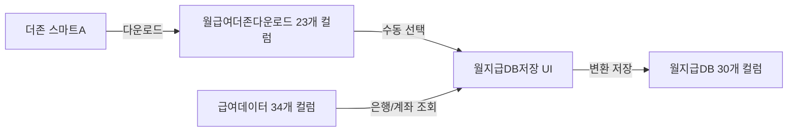

# 월급여더존다운로드 시트 스키마

## 📋 시트 정보
- **시트명**: 월급여더존다운로드
- **용도**: 더존 회계 시스템에서 다운로드한 급여 데이터 (원본)
- **컬럼 수**: 23개 (A~W, 0-based index: 0~22)
- **데이터 방향**: 더존 → 스프레드시트 (읽기 전용)
- **관련 시트**: 월지급DB (이 시트의 데이터를 월지급DB로 수동 저장)

## 🔍 데이터 출처
- **더존 스마트A**: 회계 시스템에서 급여 데이터 다운로드
- **다운로드 형식**: 더존에서 제공하는 급여 데이터 Excel 템플릿
- **업데이트 주기**: 월 1회 (급여 마감 후)

## 📊 예상 컬럼 구조

> ⚠️ **주의**: 실제 더존 시스템의 다운로드 형식에 따라 컬럼 구조가 다를 수 있습니다.
> 아래는 일반적인 더존 급여 다운로드 형식을 기준으로 작성되었습니다.

### 기본 정보 컬럼
| 열 | 컬럼명 | 타입 | 설명 |
|----|--------|------|------|
| A | 사원코드 | string | 직원 고유 식별 코드 |
| B | 사원명 | string | 직원 이름 |
| C | 부서 | string | 소속 부서 |
| D | 직급 | string | 직급/직책 |

### 급여 항목 컬럼
| 열 | 컬럼명 | 타입 | 설명 |
|----|--------|------|------|
| E | 기본급 | number | 기본 급여 |
| F | 상여 | number | 상여금 |
| G | 식대수당 | number | 식대 수당 |
| H | 직책수당 | number | 직책 수당 |
| I | 연장근로수당 | number | 연장 근로 수당 |
| J | 연차수당 | number | 연차 수당 |
| K | 야간수당 | number | 야간 근무 수당 |
| L | 공휴일특근수당 | number | 공휴일 특근 수당 |
| M | 기타수당 | number | 기타 수당 |
| N | 총지급액 | number | 급여 합계 |

### 공제 항목 컬럼
| 열 | 컬럼명 | 타입 | 설명 |
|----|--------|------|------|
| O | 국민연금 | number | 국민연금 공제액 |
| P | 건강보험 | number | 건강보험료 |
| Q | 고용보험 | number | 고용보험료 (직원 부담) |
| R | 장기요양보험 | number | 장기요양보험료 |
| S | 소득세 | number | 소득세 |
| T | 지방소득세 | number | 지방소득세 |

### 사업주 부담 컬럼
| 열 | 컬럼명 | 타입 | 설명 |
|----|--------|------|------|
| U | 사업주고용보험 | number | 고용보험료 (사업주 부담) |
| V | 산재보험료 | number | 산재보험료 |

### 최종 금액 컬럼
| 열 | 컬럼명 | 타입 | 설명 |
|----|--------|------|------|
| W | 차인지급액 | number | 실제 지급액 (세후지급액) |

## 🔗 연관 시트 - 급여데이터 (은행 정보 출처)

> **중요**: 월급여더존다운로드는 23개 컬럼만 포함하므로, 은행/계좌 정보는 **급여데이터** 시트에서 조회합니다.

### 급여데이터 시트 구조
- **컬럼 수**: 34개 (A~AH, 0-based index: 0~33)
- **은행 정보 위치**:
  | 인덱스 | 컬럼 | 내용 | 사용처 |
  |--------|------|------|--------|
  | 31 | AF | 급여 지급 은행 | `getEmployeeBankInfo()` |
  | 32 | AG | 계좌 번호 | `getEmployeeBankInfo()` |
  | 33 | AH | 예금주 | 데이터 검증용 |

### 은행 정보 조회 로직
```javascript
// src/payroll/savePayrollDB.js - getEmployeeBankInfo()
function getEmployeeBankInfo(name) {
  // 급여데이터 시트에서 이름으로 검색
  // row[31] = AF열 (은행)
  // row[32] = AG열 (계좌번호)
  // row[33] = AH열 (예금주, 검증용)
  return { bank: row[31], accountNumber: row[32] };
}
```

## 🔄 데이터 처리 흐름



## 📐 월지급DB 변환 매핑

### 데이터 변환 규칙
```
월급여더존다운로드 → 월지급DB (30개 컬럼)

기본 정보:
  급여기준월: 시스템 생성 (YYYY-MM-DD 말일)
  이름: 사원명 (B열)

급여 항목 (C~L):
  C: 총급여 = 총지급액 (N열)
  D~M: 급여 항목 그대로 매핑 (E~M열)

공제 항목 (M~V):
  M: 국민연금 (O열)
  N: 건강보험료 (P열)
  O: 고용보험료 (Q열)
  P: 장기요양보험료 (R열)
  Q: 사업주추가고용보험료 (U열)
  R: 산재보험료 (V열)
  S: 소득세 (S열)
  T: 지방소득세 (T열)
  U~V: 연말정산 (빈칸)

계산 컬럼 (W~AA):
  W: 세후지급액 (W열 또는 차인지급액)
  X: 차인지급액계 = W
  Y: 사업주부담1 = Q
  Z: 산재보험료2 = R
  AA: 총비용 = C + Q + R

입금 정보 (AB~AD):
  AB: 입금처리여부 = "대기"
  AC: 은행 = 급여데이터.AF(31) - getEmployeeBankInfo() 함수 사용
  AD: 계좌번호 = 급여데이터.AG(32) - getEmployeeBankInfo() 함수 사용
```

### 은행 정보 매핑 상세
```javascript
// 급여데이터 시트 (34개 컬럼)
// AF(31): 급여 지급 은행 → 월지급DB.AC
// AG(32): 계좌 번호 → 월지급DB.AD
// AH(33): 예금주 → 검증 목적 (직원 이름과 일치 확인)

// 인덱스 주의사항:
// - JavaScript 배열은 0-based index
// - A열=0, B열=1, ..., AF열=31, AG열=32, AH열=33
// - 절대 row.length-2, row.length-1 같은 동적 계산 사용 금지!
```

## 🎯 사용 시나리오

### 1. 더존에서 데이터 다운로드
```
1. 더존 스마트A 접속
2. 급여 관리 → 월급여 다운로드
3. Excel 파일로 저장
4. 월급여더존다운로드 시트에 복사/붙여넣기
```

### 2. 월지급DB 저장 (수동)
```
1. 급여 관리 메뉴 → 5. 월지급DB 저장
2. 급여기준월 입력 (예: 2026-01-31)
3. 데이터 불러오기 버튼 클릭
4. 저장할 직원 선택 (중복 자동 차단)
5. 저장 버튼 클릭
```

### 3. 중복 체크 로직
```javascript
// 중복 기준: 급여기준월 + 이름
function checkDuplicate(month, name) {
  // 월지급DB에서 동일 월 + 동일 이름 존재 여부 확인
  // 존재하면 체크박스 비활성화
}
```

## ⚠️ 주의사항

### 데이터 무결성
- **원본 보존**: 더존에서 다운로드한 원본 데이터는 수정하지 않음
- **읽기 전용**: 이 시트는 참조용으로만 사용 (직접 수정 금지)
- **백업**: 다운로드 후 원본 Excel 파일 보관 권장

### 개인정보 보호
- 급여 정보 포함 (민감 정보)
- 접근 권한 관리 필요
- 더존 다운로드 후 즉시 시트에 저장하고 원본 파일 삭제 권장

### 데이터 검증
- **사원명 확인**: 급여데이터 시트와 이름 일치 여부 확인
- **금액 검증**: 총지급액 = 급여 항목 합계 확인
- **은행 정보**: 급여데이터.AF(31), AG(32)에 은행/계좌 정보 있는지 사전 확인
- **예금주 검증**: 급여데이터.AH(33) 예금주가 직원 이름과 일치하는지 확인

## 🔐 보안 고려사항

### 접근 제한
- 급여 담당자만 접근 가능
- 시트 보호 설정 권장
- 열람 권한 최소화

### 데이터 보관
- 월별 데이터는 월지급DB로 이전 후 삭제 가능
- 필요시 별도 아카이브 시트로 이동
- 보관 기간: 세법상 5년 (월지급DB에 저장되므로 이 시트는 삭제 가능)

## 📝 실제 구조 확인 필요

> ⚠️ **TODO**: 실제 더존 시스템에서 다운로드한 파일의 구조를 확인하여 이 스키마를 업데이트해야 합니다.
>
> 확인 항목:
> - [ ] 실제 컬럼 수
> - [ ] 컬럼명 (한글/영문)
> - [ ] 컬럼 순서
> - [ ] 데이터 타입
> - [ ] 필수/선택 컬럼
> - [ ] 헤더 행 위치
> - [ ] 데이터 시작 행

### 실제 구조 확인 방법
```javascript
// Google Apps Script에서 실행
function checkDazoneDownloadStructure() {
  const sheet = SpreadsheetApp.getActiveSpreadsheet()
    .getSheetByName('월급여더존다운로드');

  if (!sheet) {
    Logger.log('시트가 존재하지 않습니다.');
    return;
  }

  const lastCol = sheet.getLastColumn();
  const headers = sheet.getRange(1, 1, 1, lastCol).getValues()[0];

  Logger.log('총 컬럼 수: ' + lastCol);
  Logger.log('헤더:');
  headers.forEach((header, index) => {
    const colLetter = String.fromCharCode(65 + index);
    Logger.log(`  ${colLetter}: ${header}`);
  });
}
```

---

**작성일**: 2026-01-31
**버전**: v1.1 (은행 정보 버그 수정 반영)
**상태**: ✅ 검증 완료

**관련 시트**:
- 월지급DB (저장 대상, 30개 컬럼)
- 급여데이터 (은행/계좌 정보 출처, 34개 컬럼)

**관련 파일**:
- `src/payroll/savePayrollDB.js` (저장 핸들러 - getEmployeeBankInfo() 수정 완료)
- `src/payroll/html/savePayrollDBUI.html` (저장 UI)

**버그 수정 이력**:
- 2026-01-31: getEmployeeBankInfo() 함수 인덱스 버그 수정
  - 변경 전: `row[row.length-2]`, `row[row.length-1]` (잘못된 동적 계산)
  - 변경 후: `row[31]` (AF열), `row[32]` (AG열) (정확한 인덱스)
