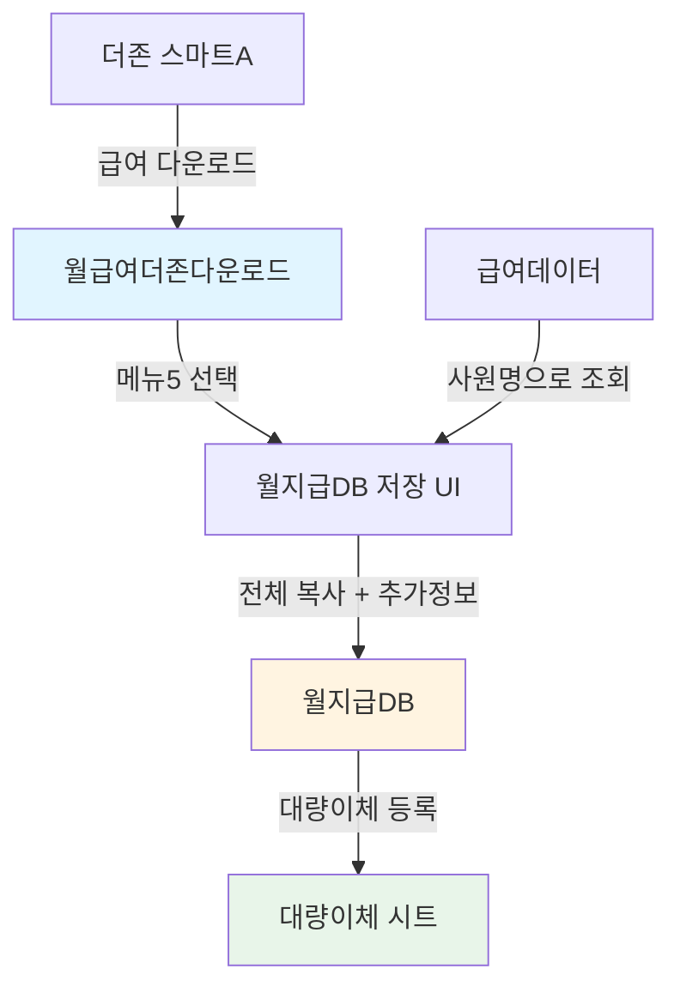

# 월지급DB 시트 스키마

## 📋 시트 정보
- **시트명**: 월지급DB
- **총 컬럼 수**: 32개 (A~AF)
- **구조**: 급여기준월(A) + 월급여더존다운로드 전체(B~AB) + 입금정보(AC~AF)
- **용도**: 월별 급여 지급 내역 영구 저장 (히스토리 관리)

## 📊 컬럼 구조

### 전체 구조 = A + (B~AB) + (AC~AF)
- **A열**: 급여기준월 (시스템 생성)
- **B~AB열**: 월급여더존다운로드 전체 복사
- **AC~AF열**: 입금 관리 정보

### A열: 시스템 생성

| 열 | 인덱스 | 컬럼명 | 타입 | 설명 | 출처 |
|----|--------|--------|------|------|------|
| A | 0 | 급여기준월 | date | 급여 지급 기준 월 (말일) | 시스템 생성 |

### B~F열: 기본 정보 (더존 A~E 복사)

| 열 | 인덱스 | 컬럼명 | 타입 | 설명 | 출처 |
|----|--------|--------|------|------|------|
| B | 1 | 사원코드 | string | 직원 사원코드 | 더존.A(0) |
| C | 2 | 사원명 | string | 직원 이름 | 더존.B(1) |
| D | 3 | 부서 | string | 소속 부서 | 더존.C(2) |
| E | 4 | 직급 | string | 직급/직책 | 더존.D(3) |
| F | 5 | 직종 | string | 직종 구분 | 더존.E(4) |

### G~P열: 급여 항목 (더존 F~O 복사)

| 열 | 인덱스 | 컬럼명 | 타입 | 설명 | 출처 |
|----|--------|--------|------|------|------|
| G | 6 | 기본급 | number | 기본 급여 | 더존.F(5) |
| H | 7 | 상여 | number | 상여금 | 더존.G(6) |
| I | 8 | 식대수당 | number | 식대 수당 | 더존.H(7) |
| J | 9 | 직책수당 | number | 직책 수당 | 더존.I(8) |
| K | 10 | 연장근로수당 | number | 연장 근로 수당 | 더존.J(9) |
| L | 11 | 연차수당 | number | 연차 수당 | 더존.K(10) |
| M | 12 | 야간수당 | number | 야간 근무 수당 | 더존.L(11) |
| N | 13 | 공휴일특근수당 | number | 공휴일 특근 수당 | 더존.M(12) |
| O | 14 | 기타수당 | number | 기타 수당 | 더존.N(13) |
| P | 15 | 지급액계 | number | 총 급여 합계 | 더존.O(14) |

### Q~T열: 보험 항목 (더존 P~S 복사)

| 열 | 인덱스 | 컬럼명 | 타입 | 설명 | 출처 |
|----|--------|--------|------|------|------|
| Q | 16 | 국민연금 | number | 국민연금 공제액 | 더존.P(15) |
| R | 17 | 건강보험 | number | 건강보험료 | 더존.Q(16) |
| S | 18 | 고용보험 | number | 고용보험료(직원) | 더존.R(17) |
| T | 19 | 장기요양보험료 | number | 장기요양보험료 | 더존.S(18) |

### U~V열: 세금 항목 (더존 T~U 복사)

| 열 | 인덱스 | 컬럼명 | 타입 | 설명 | 출처 |
|----|--------|--------|------|------|------|
| U | 20 | 소득세 | number | 소득세 | 더존.T(19) |
| V | 21 | 지방소득세 | number | 지방소득세 | 더존.U(20) |

### W~Y열: 연말정산 항목 (더존 V~X 복사)

| 열 | 인덱스 | 컬럼명 | 타입 | 설명 | 출처 |
|----|--------|--------|------|------|------|
| W | 22 | 연말정산소득세 | number | 연말정산 소득세 | 더존.V(21) |
| X | 23 | 연말정산지방소득세 | number | 연말정산 지방소득세 | 더존.W(22) |
| Y | 24 | 연말정산선불특 | number | 연말정산 선불특별세액 | 더존.X(23) |

### Z~AB열: 공제 및 지급액 (더존 Y~AA 복사)

| 열 | 인덱스 | 컬럼명 | 타입 | 설명 | 출처 |
|----|--------|--------|------|------|------|
| Z | 25 | 학자금상환액 | number | 학자금 상환액 | 더존.Y(24) |
| AA | 26 | 공제액계 | number | 총 공제액 합계 | 더존.Z(25) |
| AB | 27 | 차인지급액 | number | 최종 지급액 | 더존.AA(26) |

### AC~AF열: 입금 관리 정보 (시스템/조회)

| 열 | 인덱스 | 컬럼명 | 타입 | 설명 | 출처 |
|----|--------|--------|------|------|------|
| AC | 28 | 입금처리여부 | string | 입금 처리 상태 | 시스템 기본값 ("대기") |
| AD | 29 | 은행 | string | 입금 은행명 | 급여데이터.AF(31) 조회 |
| AE | 30 | 계좌번호 | string | 입금 계좌번호 | 급여데이터.AG(32) 조회 |
| AF | 31 | 예금주 | string | 계좌 예금주명 | 더존.B(1) = 사원명 |

## 🔢 계산 공식

### 더존 다운로드 시트에서 이미 계산된 값 사용

#### 1. 지급액계 (P열)
```
지급액계 = 기본급 + 상여 + 식대수당 + 직책수당 + 연장근로수당 + 연차수당 + 야간수당 + 공휴일특근수당 + 기타수당

P = G + H + I + J + K + L + M + N + O

⚠️ 더존 시트에서 계산된 값을 그대로 가져옴 (재계산 하지 않음)
```

#### 2. 공제액계 (AA열)
```
공제액계 = 국민연금 + 건강보험 + 고용보험 + 장기요양보험료 + 소득세 + 지방소득세 + 연말정산 관련 + 학자금상환액

AA = Q + R + S + T + U + V + W + X + Y + Z

⚠️ 더존 시트에서 계산된 값을 그대로 가져옴 (재계산 하지 않음)
```

#### 3. 차인지급액 (AB열)
```
차인지급액 = 지급액계 - 공제액계

AB = P - AA

⚠️ 더존 시트에서 계산된 값을 그대로 가져옴 (재계산 하지 않음)
```

### 시스템 생성 값

#### 4. 급여기준월 (A열)
```
급여기준월 = 사용자가 선택한 월의 말일

예: "2024-01" 선택 → 2024-01-31
예: "2024-02" 선택 → 2024-02-29 (윤년)
```

#### 5. 입금처리여부 (AC열)
```
입금처리여부 = "대기" (기본값)

저장 시점: "대기"
입금 완료 후: "완료" (수동 변경)
```

#### 6. 예금주 (AF열)
```
예금주 = 사원명 (C열과 동일)

AF = C
```

## 📐 데이터 그룹

### 1. 시스템 정보 (A) - 1개
- **A: 급여기준월** (시스템 생성)

### 2. 기본 정보 (B~F) - 5개
- **B: 사원코드** (직원 식별자)
- **C: 사원명** (직원 이름)
- **D~F: 조직 정보** (부서, 직급, 직종)

### 3. 지급 항목 (G~P) - 10개
- **G~H: 기본 급여** (기본급, 상여)
- **I~O: 수당** (식대, 직책, 연장근로, 연차, 야간, 공휴일특근, 기타)
- **P: 지급액계** (총 급여 합계)

### 4. 공제 항목 (Q~AA) - 11개
- **Q~T: 4대 보험** (국민연금, 건강보험, 고용보험, 장기요양보험료)
- **U~V: 원천징수** (소득세, 지방소득세)
- **W~Y: 연말정산** (연말정산소득세, 연말정산지방소득세, 연말정산선불특)
- **Z: 학자금상환액** (학자금 대출 상환)
- **AA: 공제액계** (총 공제액 합계)

### 5. 지급액 (AB) - 1개
- **AB: 차인지급액** (최종 실지급액 = 지급액계 - 공제액계)

### 6. 입금 관리 (AC~AF) - 4개
- **AC: 입금처리여부** (대기/완료)
- **AD~AF: 계좌 정보** (은행, 계좌번호, 예금주)

## 💡 계산 예시

### 입력 값
```
D (기본급): 3,000,000원
E (상여): 500,000원
F (식대수당): 200,000원
G (직책수당): 300,000원
H~L (기타 수당): 각 0원

M (국민연금): 135,000원
N (건강보험료): 100,000원
O (고용보험료): 40,000원
P (장기요양보험료): 13,000원
Q (사업주추가고용보험료): 40,000원
R (산재보험료): 30,000원
S (소득세): 150,000원
T (지방소득세): 15,000원
```

### 계산 과정
```
1. C (총급여)
   = 3,000,000 + 500,000 + 200,000 + 300,000
   = 4,000,000원

2. W (세후지급액)
   = 4,000,000 - 135,000 - 100,000 - 40,000 - 13,000 - 150,000 - 15,000
   = 3,547,000원

3. X (차인지급액계)
   = W = 3,547,000원

4. Y (사업주부담 １)
   = Q = 40,000원

5. Z (산재보험료2)
   = R = 30,000원

6. AA (총비용)
   = 4,000,000 + 40,000 + 30,000
   = 4,070,000원
```

### 비용 분석
```
직원 수령액: 3,547,000원 (세후지급액)
회사 부담액: 523,000원 (사업주 보험료 + 원천징수 세금)
총 인건비: 4,070,000원 (직원급여 + 사업주 보험료)
```

## 📝 데이터 흐름

### v3.0 구조 (월급여더존다운로드 전체 복사)


**데이터 구조 (v3.0)**:
```
월지급DB (32개 컬럼: A~AF)
├─ A열: 급여기준월 (시스템 생성)
├─ B~AB열: 월급여더존다운로드 전체 복사 (26개 컬럼)
│   ├─ B~F: 기본정보 (사원코드, 사원명, 부서, 직급, 직종)
│   ├─ G~P: 급여항목 (기본급~지급액계)
│   ├─ Q~T: 보험항목 (국민연금~장기요양보험료)
│   ├─ U~V: 세금항목 (소득세, 지방소득세)
│   ├─ W~Y: 연말정산 (연말정산소득세~연말정산선불특)
│   └─ Z~AB: 공제 및 지급 (학자금상환액, 공제액계, 차인지급액)
└─ AC~AF열: 입금 관리 정보 (4개 컬럼)
    ├─ AC: 입금처리여부 (시스템 기본값 "대기")
    ├─ AD~AE: 은행정보 (급여데이터에서 조회)
    └─ AF: 예금주 (사원명 복사)
```

**저장 방법 변경 이력**:
- **v1.0 (구버전)**: 월지급계산 → 자동 저장 → 월지급DB (23개 컬럼)
- **v2.0 (중간)**: 월급여더존다운로드 → 수동 저장 → 월지급DB (30개 컬럼, 잘못 설계)
- **v3.0 (현재)**: 월급여더존다운로드 → 수동 저장 → 월지급DB (32개 컬럼, 전체 복사)

**v3.0 설계 원칙**:
1. **데이터 무손실**: 더존 원본 데이터 전체 보존
2. **중복 제거**: 계산 로직 제거, 더존 계산값 그대로 사용
3. **추적 가능성**: 사원코드, 부서, 직급, 직종 정보 유지
4. **입금 관리**: 입금 처리 상태 및 계좌 정보 추가

## 🔍 월지급계산과의 차이

### 컬럼 비교

| 항목 | 월지급계산 | 월지급DB |
|------|------------|----------|
| 컬럼 수 | 23개 (A~W) | 30개 (A~AD) |
| 기본 데이터 | A~W | A~W (동일) |
| 추가 계산 | 없음 | X~AA (4개) |
| 입금 정보 | 없음 | AB~AD (3개) |
| 용도 | 월별 계산/수정 | 영구 저장 (DB) |
| 데이터 업데이트 | 가능 (기존 행 수정) | 추가만 가능 (append) |

### 추가 컬럼의 의미

#### X (차인지급액계)
- **용도**: 더존 회계 시스템 업로드용
- **값**: W열(세후지급액)과 동일
- **이유**: 더존 업로드 시트에서 사용하는 컬럼명

#### Y~Z (사업주 부담 상세)
- **용도**: 회계 처리 및 비용 분석
- **Y**: 사업주 고용보험료
- **Z**: 산재보험료
- **이유**: 비용 항목 분리 표시

#### AA (총비용)
- **용도**: 회사 인건비 총액 파악
- **계산**: 급여 + 사업주 부담 보험료
- **활용**: 예산 관리, 손익 분석

#### AB~AD (입금 정보)
- **용도**: 급여 입금 처리 관리
- **AB**: 입금 완료 여부 추적
- **AC~AD**: 입금 계좌 정보 보관

## 📊 회계 처리 지원

### 비용 항목 분류
```
1. 급여 (C열)
   - 기본급 (D)
   - 상여 (E)
   - 수당 (F~L)

2. 사업주 부담 법정복리비
   - 사업주추가고용보험료 (Q, Y)
   - 산재보험료 (R, Z)

3. 총 인건비 (AA열)
   = 급여 + 법정복리비
```

### 손익계산서 반영
```
판매비와관리비
├─ 급여: C열 합계
├─ 법정복리비: (Q + R) 합계
└─ 세금과공과: (S + T) 합계 (회사 부담분)
```

## 🎯 사용 목적

### 1. 히스토리 관리
- 월별 급여 지급 내역 영구 보관
- 연도별, 월별 급여 추이 분석
- 직원별 급여 이력 조회

### 2. 회계 처리
- 급여 분개 자동 생성
- 비용 항목별 집계
- 예산 대비 실적 분석

### 3. 세무 신고
- 원천징수 내역 집계
- 4대 보험 신고 자료
- 연말정산 기초 자료

### 4. 입금 관리
- 급여 입금 처리 추적
- 입금 계좌 정보 관리
- 입금 완료 여부 확인

## ⚠️ 중요 사항

### 데이터 무결성
- **추가만 가능**: 기존 데이터 수정 불가 (히스토리 보존)
- **삭제 금지**: 감사 증빙 자료로 영구 보관
- **백업 필수**: 정기적인 데이터 백업

### 개인정보 보호
- 민감 정보 포함 (이름, 급여, 계좌번호)
- 접근 권한 관리 필요
- 보안 정책 준수

### 연말정산 처리
- W, X, Y열 (연말정산 관련)은 연말정산 시점에만 값 입력
- 연말정산 전에는 더존에서 다운로드한 값 그대로 저장
- 연말정산 후 별도 시트로 관리 권장

### 💡 v3.0 개선 사항

#### ✅ 데이터 완전성
- **사원코드 추가**: 직원 고유 식별자 보존
- **조직 정보 추가**: 부서, 직급, 직종 정보 유지
- **연말정산 정보 추가**: 연말정산소득세, 연말정산지방소득세, 연말정산선불특
- **학자금상환액 추가**: 학자금 대출 상환 내역
- **공제액계 추가**: 총 공제액 합계
- **예금주 추가**: 계좌 예금주명 (사원명과 대조용)

#### ✅ 구조 단순화
- **계산 제거**: 더존에서 계산된 값을 그대로 사용 (재계산 오류 방지)
- **데이터 무손실**: 월급여더존다운로드의 모든 정보 보존
- **추적 가능성**: 원본 데이터와 1:1 대응으로 검증 용이

## 🔐 데이터 보안

### 접근 권한
- **읽기**: 경영진, 회계 담당
- **쓰기**: 급여 담당자만
- **삭제**: 불가

### 보안 조치
- 시트 보호 설정
- 범위별 권한 관리
- 변경 이력 추적

---

**작성일**: 2026-01-31
**최종 수정일**: 2026-01-31
**버전**: v3.0 (실제 시트 구조 반영 완료)
**변경 사항**:
- v2.0: A~W: 월지급계산과 동일하게 23개 컬럼으로 확장
- v2.0: X~AA: 추가 계산 컬럼 (차인지급액계, 사업주부담, 총비용)
- v2.0: AB~AD: 입금 관리 컬럼 추가
- v2.1: 저장 방식 변경 (자동 → 수동)
- v2.1: 데이터 출처 변경 (월지급계산 → 월급여더존다운로드)
- v2.2: 출처 컬럼 정확성 검증 및 수정 (코드 기준)
- v2.3: 인덱스 오류 수정 (모든 급여 항목 1칸씩 밀림 해결)
- **v3.0**: **🎯 실제 시트 구조 반영** - 32개 컬럼 (A~AF), 월급여더존다운로드 전체 복사 구조

**관련 파일**:
- `src/payroll/savePayrollDB.js` (저장 핸들러 - convertDazoneToPayrollDB 함수)
- `src/payroll/html/savePayrollDBUI.html` (저장 UI)
- `src/payroll/schemas/월급여더존다운로드_schema.md` (**주 데이터 출처** - A~W열)
- `src/payroll/schemas/급여데이터_schema.md` (은행/계좌 조회 - AC~AD열)
- `src/payroll/schemas/대량이체_schema.md` (활용 스키마)
- `src/payroll/monthlyPayrollUIHandler.js` (구 자동 저장 방식 - 미사용)
- `src/payroll/schemas/월지급계산_schema.md` (참고용)
