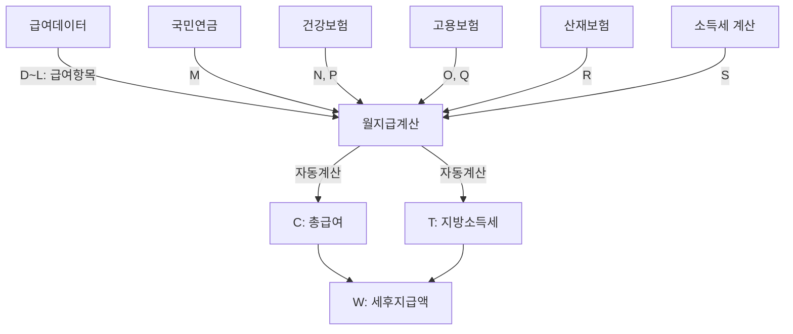

# 월지급계산 시트 스키마

## 📋 시트 정보
- **시트명**: 월지급계산
- **총 컬럼 수**: 23개 (A~W)
- **용도**: 월별 급여 지급액 계산 및 관리

## 📊 컬럼 구조

| 열 | 인덱스 | 컬럼명 | 타입 | 설명 | 출처 |
|----|--------|--------|------|------|------|
| A | 0 | 급여기준월 | date | 급여 지급 기준 월 | 시스템 생성 |
| B | 1 | 이름 | string | 직원 이름 | 급여데이터.B |
| C | 2 | 총급여 | number | 월 총급여 합계 | 계산 (D~L 합계) |
| D | 3 | 기본급 | number | 기본 급여 | 급여데이터 |
| E | 4 | 상여 | number | 상여금 | 급여데이터 |
| F | 5 | 식대수당 | number | 식대 수당 | 급여데이터 |
| G | 6 | 직책수당 | number | 직책 수당 | 급여데이터 |
| H | 7 | 연장근로수당 | number | 연장 근로 수당 | 급여데이터 |
| I | 8 | 연차수당 | number | 연차 수당 | 급여데이터 |
| J | 9 | 야간수당 | number | 야간 근무 수당 | 급여데이터 |
| K | 10 | 공휴일특근수당 | number | 공휴일 특근 수당 | 급여데이터 |
| L | 11 | 기타수당 | number | 기타 수당 | 급여데이터 |
| M | 12 | 국민연금 | number | 국민연금 공제액 | 국민연금.I |
| N | 13 | 건강보험료 | number | 건강보험료 | 건강보험.O |
| O | 14 | 고용보험료 | number | 고용보험료(직원) | 고용보험.K |
| P | 15 | 장기요양보험료 | number | 장기요양보험료 | 건강보험.AB |
| Q | 16 | 사업주추가고용보험료 | number | 고용보험료(사업주) | 고용보험.Z |
| R | 17 | 산재보험료 | number | 산재보험료 | 산재보험.O |
| S | 18 | 소득세 | string | 소득세 (빈칸) | 수동 입력 필요 (계산 안 함) |
| T | 19 | 지방소득세 | string | 지방소득세 (빈칸) | 수동 입력 필요 (계산 안 함) |
| U | 20 | 연말정산 소득세 | string | 연말정산 소득세 (빈칸) | 수동 입력 필요 (계산 안 함) |
| V | 21 | 연말정산 지방소득세 | string | 연말정산 지방소득세 (빈칸) | 수동 입력 필요 (계산 안 함) |
| W | 22 | 세후지급액 | string | 최종 지급액 (공란) | 수동 입력 필요 (계산 안 함) |

## 🔢 계산 공식

### 1. 총급여 (C열)
```
총급여 = 기본급 + 상여 + 식대수당 + 직책수당 + 연장근로수당 + 연차수당 + 야간수당 + 공휴일특근수당 + 기타수당

C = D + E + F + G + H + I + J + K + L
```

### 2. 소득세/지방소득세 (S-T열)
```
⚠️ 자동 계산하지 않음 - 공란으로 유지

S = '' (빈 문자열)
T = '' (빈 문자열)

계산 공식 (참고용, 적용 안 함):
- 소득세 = (총급여 - 4대보험) × 5% (간이 계산)
- 지방소득세 = 소득세 × 10%
```

### 3. 세후지급액 (W열)
```
⚠️ 자동 계산하지 않음 - 공란으로 유지

W = '' (빈 문자열)
```

**참고**:
- 세후지급액은 자동으로 계산하지 않고 필요시 수동으로 입력
- 계산 공식 (참고용): C - M - N - O - P - S - T
- 사업주추가고용보험료(Q), 산재보험료(R), 연말정산 세금(U,V)은 실지급액 계산에 포함되지 않음

## 📐 데이터 그룹

### 1. 기본 정보 (A~B)
- 급여기준월, 이름

### 2. 지급 항목 (C~L) - 10개
- **C: 총급여** (합계)
- **D~E: 기본 급여** (기본급, 상여)
- **F~L: 수당** (식대, 직책, 연장근로, 연차, 야간, 공휴일특근, 기타)

### 3. 공제 항목 - 4대 보험 (M~P) - 4개
- **M: 국민연금**
- **N: 건강보험료**
- **O: 고용보험료** (직원 부담)
- **P: 장기요양보험료**

### 4. 사업주 부담 (Q~R) - 2개
- **Q: 사업주추가고용보험료**
- **R: 산재보험료**

### 5. 세금 항목 (S~V) - 4개
- **S~T: 원천징수** (소득세, 지방소득세)
- **U~V: 연말정산** (연말정산 소득세, 연말정산 지방소득세)

### 6. 최종 금액 (W)
- **W: 세후지급액** (실지급액)

## 💡 계산 예시

### 입력 값
```
D (기본급): 3,000,000원
E (상여): 500,000원
F (식대수당): 200,000원
G (직책수당): 300,000원
H~L (기타 수당): 각 0원

M (국민연금): 135,000원
N (건강보험료): 100,000원
O (고용보험료): 40,000원
P (장기요양보험료): 13,000원
S (소득세): 150,000원
T (지방소득세): 15,000원 (소득세의 10%)
```

### 계산 과정
```
1. C (총급여)
   = 3,000,000 + 500,000 + 200,000 + 300,000 + 0 + 0 + 0 + 0 + 0
   = 4,000,000원

2. T (지방소득세) - 자동 계산
   = 150,000 × 0.1
   = 15,000원

3. W (세후지급액)
   = 4,000,000 - 135,000 - 100,000 - 40,000 - 13,000 - 150,000 - 15,000
   = 3,547,000원
```

## 📝 데이터 흐름



## 🔍 주요 특징

### 급여 항목 상세화
- 기존: 총급여만 표시
- 현재: **기본급, 상여 포함 9개 수당 항목 상세 표시**

### 상여 항목 추가
- **E열: 상여** - 기본급 다음에 위치
- 월별 성과급, 보너스 등을 별도 관리

### 세금 처리
- **원천징수**: S(소득세), T(지방소득세)
- **연말정산**: U(연말정산 소득세), V(연말정산 지방소득세)
- 지방소득세는 소득세의 10% 자동 계산

### 사업주 부담 항목
- **Q: 사업주추가고용보험료** - 실지급액 계산에서 제외
- **R: 산재보험료** - 실지급액 계산에서 제외

## ⚠️ 중요 사항

### 공제 항목 vs 사업주 부담
```
실지급액 공제 대상:
✓ M: 국민연금
✓ N: 건강보험료
✓ O: 고용보험료
✓ P: 장기요양보험료
✓ S: 소득세
✓ T: 지방소득세

실지급액 공제 제외:
✗ Q: 사업주추가고용보험료 (회사 부담)
✗ R: 산재보험료 (회사 부담)
✗ U: 연말정산 소득세 (연말 처리)
✗ V: 연말정산 지방소득세 (연말 처리)
```

### 연말정산 처리
- U, V열은 평소에는 공백
- 연말정산 시점에만 입력
- 실지급액에는 반영하지 않음 (별도 정산)

## 🎯 사용 시나리오

1. **급여 계산**: 급여데이터 → 월지급계산 (자동 계산)
2. **보험 매칭**: 보험 시트 → 월지급계산 (자동 입력)
3. **세금 입력**: 소득세 입력 → 지방소득세 자동 계산
4. **지급액 확인**: 세후지급액(W) 확인
5. **더존 업로드**: 월지급더존업로드 시트로 변환
6. **DB 저장**: 월지급DB에 히스토리 저장

---

**작성일**: 2026-01-30
**버전**: v2.0 (구조 업데이트)
**변경 사항**:
- 총급여 분해: 기본급, 상여 포함 9개 수당 항목 추가
- 상여 항목 추가 (E열)
- 소득세/지방소득세 추가 (S~T열)
- 연말정산 세금 추가 (U~V열)
- 세후지급액 계산 공식 변경

**관련 파일**:
- `src/payroll/monthlyPayrollUIHandler.js`
- `src/payroll/schemas/월지급DB_schema.md`
- `src/payroll/schemas/월지급더존업로드_schema.md`
