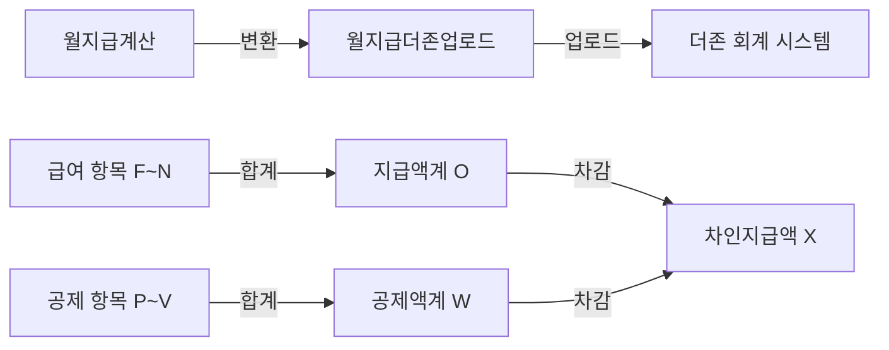

# 월지급더존업로드 시트 스키마

## 📋 시트 정보
- **시트명**: 월지급더존업로드
- **총 컬럼 수**: 24개 (A~X)
- **용도**: 더존 회계 시스템 업로드용 급여 데이터

## 📊 컬럼 구조

| 열 | 인덱스 | 컬럼명 | 타입 | 설명 |
|----|--------|--------|------|------|
| A | 0 | 사원코드 | string | 직원 고유 코드 |
| B | 1 | 사원명 | string | 직원 이름 |
| C | 2 | 부서 | string | 소속 부서 |
| D | 3 | 직급 | string | 직급/직책 |
| E | 4 | 직종 | string | 직종 분류 |
| F | 5 | 기본급 | number | 기본 급여 |
| G | 6 | 상여 | number | 상여금 |
| H | 7 | 식대수당 | number | 식대 수당 |
| I | 8 | 직책수당 | number | 직책 수당 |
| J | 9 | 연장근로수당 | number | 연장 근로 수당 |
| K | 10 | 연차수당 | number | 연차 수당 |
| L | 11 | 야간수당 | number | 야간 근무 수당 |
| M | 12 | 공휴일특근수당 | number | 공휴일 특근 수당 |
| N | 13 | 기타수당 | number | 기타 수당 |
| O | 14 | 지급액계 | number | 총 지급액 합계 |
| P | 15 | 국민연금 | number | 국민연금 공제액 |
| Q | 16 | 건강보험 | number | 건강보험료 |
| R | 17 | 고용보험 | number | 고용보험료 |
| S | 18 | 장기요양보험료 | number | 장기요양보험료 |
| T | 19 | 소득세 | string | 소득세 (빈칸) | 수동 입력 필요 (계산 안 함) |
| U | 20 | 지방소득세 | string | 지방소득세 (빈칸) | 수동 입력 필요 (계산 안 함) |
| V | 21 | 학자금상환액 | number | 학자금 상환액 |
| W | 22 | 공제액계 | number | 총 공제액 합계 |
| X | 23 | 차인지급액 | string | 실제 지급액 (공란) |

## 🔢 계산 공식

### 지급액계 (O열)
```
지급액계 = 기본급 + 상여 + 식대수당 + 직책수당 + 연장근로수당 + 연차수당 + 야간수당 + 공휴일특근수당 + 기타수당

O = F + G + H + I + J + K + L + M + N
```

### 공제액계 (W열)
```
⚠️ 소득세/지방소득세가 빈칸이므로 계산에서 제외

공제액계 = 국민연금 + 건강보험 + 고용보험 + 장기요양보험료 + 학자금상환액
W = P + Q + R + S + V

참고: T, U열(소득세, 지방소득세)은 빈칸이므로 합계에 포함 안 됨
```

### 차인지급액 (X열)
```
⚠️ 자동 계산하지 않음 - 공란으로 유지

X = '' (빈 문자열)

계산 공식 (참고용): O - W (지급액계 - 공제액계)
```

**참고**: 더존 업로드 시 필요하면 수동으로 계산하여 입력

## 📐 데이터 그룹

### 1. 기본 정보 (A~E)
- 사원코드, 사원명, 부서, 직급, 직종

### 2. 급여 항목 (F~N) - 9개
- 기본급, 상여
- 식대수당, 직책수당
- 연장근로수당, 연차수당, 야간수당
- 공휴일특근수당, 기타수당

### 3. 지급액 (O)
- 지급액계 (총 지급액)

### 4. 공제 항목 (P~V) - 7개
- 4대 보험: 국민연금, 건강보험, 고용보험, 장기요양보험료
- 세금: 소득세, 지방소득세
- 기타: 학자금상환액

### 5. 최종 금액 (W~X)
- 공제액계 (총 공제액)
- 차인지급액 (실지급액)

## 💡 계산 예시

### 입력 값
```
F (기본급): 3,000,000원
G (상여): 500,000원
H (식대수당): 200,000원
I (직책수당): 300,000원
J~N (기타 수당): 각 0원

P (국민연금): 135,000원
Q (건강보험): 100,000원
R (고용보험): 40,000원
S (장기요양보험료): 13,000원
T (소득세): 150,000원
U (지방소득세): 15,000원
V (학자금상환액): 0원
```

### 계산 과정
```
1. O (지급액계)
   = 3,000,000 + 500,000 + 200,000 + 300,000 + 0 + 0 + 0 + 0 + 0
   = 4,000,000원

2. W (공제액계)
   = 135,000 + 100,000 + 40,000 + 13,000 + 150,000 + 15,000 + 0
   = 453,000원

3. X (차인지급액)
   = 4,000,000 - 453,000
   = 3,547,000원
```

## 📝 데이터 흐름



## 🔍 더존 업로드 형식

### 필수 컬럼
- **A (사원코드)**: 더존 시스템의 사원 마스터와 매칭
- **B (사원명)**: 검증용
- **F~N (급여 항목)**: 지급 내역
- **P~V (공제 항목)**: 공제 내역
- **X (차인지급액)**: 실제 지급액

### 데이터 검증
1. 사원코드가 더존 시스템에 존재하는지 확인
2. 지급액계 = 급여 항목의 합계
3. 공제액계 = 공제 항목의 합계
4. 차인지급액 = 지급액계 - 공제액계

## 🎯 사용 목적

1. **더존 시스템 연동**: 급여 데이터 자동 업로드
2. **회계 처리**: 급여 분개 자동 생성
3. **세무 신고**: 원천징수 데이터 제공
4. **급여 명세서**: 직원 급여 명세서 발행

## 📊 월지급계산과의 차이

| 항목 | 월지급계산 | 월지급더존업로드 |
|------|------------|------------------|
| 급여기준월 | O (1열) | X (없음) |
| 사원코드 | X (없음) | O (A열) |
| 부서/직급/직종 | X (없음) | O (C~E열) |
| 급여 항목 상세 | O (F~N열) | O (F~N열) |
| 사업주 부담 보험 | O (Q열) | X (없음) |
| 연말정산 세금 | O (U~V열) | X (없음) |

### 변환 매핑
```
월지급계산 → 월지급더존업로드

B (이름) → B (사원명)
D~L (급여항목) → F~N (급여항목)
M~P (4대보험) → P~S (4대보험)
R~S (세금) → T~U (세금)
W (세후지급액) → X (차인지급액)
```

## 🔐 데이터 보안

### 민감 정보 포함
- 사원코드, 사원명 (개인정보)
- 급여 내역 (재무 정보)
- 공제 내역 (세무 정보)

### 권한 관리
- 급여 담당자만 접근 가능
- 더존 업로드 후 삭제 또는 아카이빙 권장

---

**작성일**: 2026-01-30
**버전**: v1.0
**관련 시트**:
- 월지급계산
- 월지급DB
**관련 시스템**:
- 더존 스마트A (회계 시스템)
